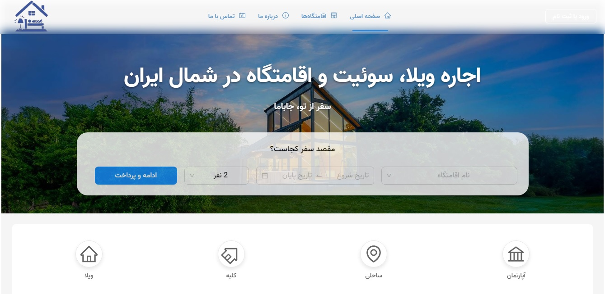

# HotelYar - پلتفرم جامع رزرواسیون اقامتگاه

<div align="center">
  
</div>

<p align="center">
  یک اپلیکیشن وب فول-استک و مدرن برای جستجو، رزرو و مدیریت اقامتگاه‌ها، که با استفاده از React و Supabase ساخته شده است.
</p>

<p align="center">
  <a href="https://your-live-deployment-url.vercel.app"><strong>🚀 مشاهده نسخه زنده (Live Demo) 🚀</strong></a>
</p>

<br/>

---
## 🇬🇧 English Version

### About The Project

**HotelYar** is a modern, feature-rich booking platform that provides a seamless experience for guests to find and book accommodations, and a powerful dashboard for administrators to manage all aspects of the platform.

Built on a robust Supabase backend, this application demonstrates a full-stack skill set, including relational database design, secure authentication, real-time data synchronization, and deployment on a modern cloud infrastructure.

<br/>

### ✨ Key Features

* **Secure User Authentication:** Full auth flow including registration with email confirmation, login, and secure password reset.
* **Role-Based Dashboards:** Separate, protected dashboards for Guests and Administrators with distinct functionalities.
* **Comprehensive Transaction Management:** An admin dashboard to view, filter, and export all financial transactions, including an analytics section with charts for tracking revenue.
* **Two-Step Refund Approval Workflow:** Guests can request a refund, creating a "pending" transaction. Administrators can then review and approve these requests, which automatically updates the status of both the transaction and the associated reservation.
* **Integrated Private Messaging System:** A "Contact Us" form allows guests and users to send private messages (suggestions/criticism) directly to the administration.
* **Admin Message Management:** A dedicated inbox in the admin dashboard for viewing and managing incoming private messages.
* **Real-time Updates:** The UI updates in real-time for new reservations and status changes using Supabase Realtime subscriptions.

### 🚀 Technical Highlights & Architecture

As a frontend developer, I took on the challenge of designing and implementing the entire backend infrastructure for this project.

* **Robust Backend with Supabase:** The application is powered by a scalable Supabase backend, utilizing a custom-designed **PostgreSQL** relational database schema with foreign key constraints, relationships (`ON DELETE CASCADE`), and optimized data types.
* **Database-Level Security with RLS:** Data access is secured at the database level using PostgreSQL's **Row Level Security (RLS) Policies**. This ensures that users can only view and modify data they own, providing a much higher level of security than API-level checks alone.
* **Database Automation with Triggers:** A custom **PostgreSQL function and trigger** were written to automatically synchronize Supabase's private `auth.users` table with a public `users` profile table, guaranteeing data consistency upon new user registration.
* **Advanced State Management:** Complex server state, caching, and data mutations are handled efficiently on the client-side with **TanStack/React Query**, including the implementation of optimistic updates for a seamless and fast user experience.

### 🛠️ Tech Stack

| Category      | Technologies                                                                          |
| ------------- | ------------------------------------------------------------------------------------- |
| **Frontend** | React, Vite, React Router, TanStack/React Query, Ant Design, Styled-Components        |
| **Backend** | Supabase (PostgreSQL, Auth, Realtime), Vercel Serverless Functions                    |
| **Deployment**| Vercel, Git, GitHub                                                                   |

### 🚀 Getting Started (Local Setup)

1.  **Clone the repo**
    ```sh
    git clone [https://github.com/your-username/your-repo-name.git](https://github.com/your-username/your-repo-name.git)
    ```
2.  **Install NPM packages**
    ```sh
    npm install
    ```
3.  **Set up Environment Variables**
    Create a `.env` file in the root and add the following keys:
    ```env
    VITE_SUPABASE_URL=YOUR_SUPABASE_PROJECT_URL
    VITE_SUPABASE_ANON_KEY=YOUR_SUPABASE_ANON_KEY
    VITE_FRONTEND_URL=http://localhost:5173
    ```
4.  **Run the development server**
    ```sh
    npm run dev
    ```
<br/>
<hr/>
<br/>

## 🇮🇷 نسخه فارسی (Persian)

### درباره پروژه

**هتل‌یار** یک پلتفرم مدرن و جامع برای رزرو اقامتگاه است که تجربه‌ای روان برای مهمانان جهت پیدا کردن و رزرو هتل، و یک داشبورد قدرتمند برای مدیران جهت مدیریت کامل پلتفرم فراهم می‌کند.

این اپلیکیشن با یک بک‌اند قوی مبتنی بر Supabase ساخته شده و نشان‌دهنده مجموعه‌ای کامل از مهارت‌های فول-استک، شامل طراحی پایگاه داده رابطه‌ای، احراز هویت امن، همگام‌سازی داده‌ها به صورت Real-time و استقرار روی زیرساخت ابری مدرن است.

<br/>

### ✨ ویژگی‌های کلیدی

* **احراز هویت امن:** فرآیند کامل و امن ثبت‌ نام با تایید ایمیل، ورود و بازیابی رمز عبور.
* **داشبوردهای مبتنی بر نقش:** داشبوردهای مجزا و محافظت‌شده برای مهمانان و مدیران با دسترسی‌ها و قابلیت‌های متفاوت.
* **سیستم مدیریت جامع تراکنش‌ها:** داشبورد کامل برای مدیران جهت مشاهده، فیلتر و خروجی گرفتن از تمام تراکنش‌های مالی، به همراه بخش تحلیلی و چارت برای بررسی درآمد.
* **فرآیند بازپرداخت وجه دو مرحله‌ای:** مهمانان می‌توانند درخواست بازپرداخت دهند که یک تراکنش «در انتظار» ایجاد می‌کند. سپس مدیران می‌توانند این درخواست‌ها را در داشبورد خود تایید کنند که به صورت خودکار وضعیت تراکنش و رزرو را آپدیت می‌کند.
* **سیستم پیام خصوصی یکپارچه:** فرم «تماس با ما» به کاربران اجازه می‌دهد تا پیام‌های خصوصی (پیشنهادات و انتقادات) را مستقیماً برای مدیریت ارسال کنند.
* **مدیریت پیام‌ها توسط مدیر:** یک صندوق ورودی اختصاصی در داشبورد ادمین برای مشاهده و مدیریت پیام‌های خصوصی دریافتی.
* **به‌روزرسانی‌های Real-time:** رابط کاربری به صورت زنده برای رزروهای جدید و تغییر وضعیت‌ها با استفاده از اشتراک‌های Supabase Realtime آپدیت می‌شود.

### 🚀 نکات برجسته فنی و معماری

من به عنوان یک توسعه‌دهنده فرانت‌اند، چالش طراحی و پیاده‌سازی کامل زیرساخت بک‌اند این پروژه را بر عهده گرفتم.

* **بک‌اند قدرتمند با Supabase:** اپلیکیشن بر روی یک بک‌اند مقیاس‌پذیر Supabase قدرت گرفته است. برای این پروژه یک اسکیمای پایگاه داده رابطه‌ای **PostgreSQL** به صورت سفارشی با روابط، کلیدهای خارجی (`ON DELETE CASCADE`) و انواع داده بهینه طراحی شده است.
* **امنیت در سطح دیتابیس با RLS:** دسترسی به داده‌ها در سطح خود پایگاه داده با استفاده از **قوانین امنیت در سطح ردیف (RLS Policies)** امن شده است. این ویژگی تضمین می‌کند که کاربران فقط به داده‌های متعلق به خود دسترسی دارند که سطح امنیت بسیار بالاتری نسبت به بررسی‌های صرف در سطح API فراهم می‌کند.
* **اتوماسیون دیتابیس با Trigger:** یک **تابع و Trigger سفارشی PostgreSQL** نوشته شده است تا به صورت خودکار جدول خصوصی `auth.users` در Supabase را با جدول پروفایل `public.users` همگام‌سازی کند. این کار یکپارچگی داده‌ها را در هنگام ثبت‌نام کاربر جدید تضمین می‌کند.
* **مدیریت وضعیت پیشرفته:** وضعیت سرور، کشینگ و تغییرات داده‌ها در سمت کلاینت به صورت بهینه با استفاده از **TanStack/React Query** مدیریت می‌شود که شامل پیاده‌سازی آپدیت‌های خوش‌بینانه (Optimistic Updates) برای ایجاد یک تجربه کاربری روان و سریع است.

### 🛠️ تکنولوژی‌های استفاده شده

| دسته          | تکنولوژی‌ها                                                                             |
| ------------- | -------------------------------------------------------------------------------------- |
| **فرانت‌اند** | React, Vite, React Router, TanStack/React Query, Ant Design, Styled-Components         |
| **بک‌اند** | Supabase (PostgreSQL, Auth, Realtime), Vercel Serverless Functions                     |
| **استقرار** | Vercel, Git, GitHub                                                                    |
